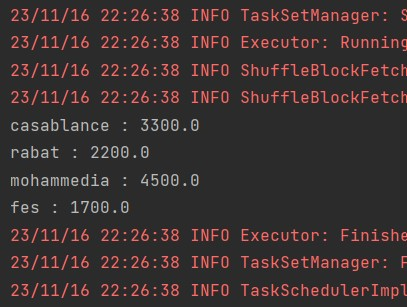

# big_data_tp4

Le but de ce Tp est de développer une application Spark permettant, à partir d’un fichier texte (ventes.txt) en entré, contenant les ventes d’une entreprise dans les différentes villes, 
de déterminer le total des ventes par ville. La structure du fichier ventes.txt est de la forme suivante :
 date ville produit prix

 Voici le fichier vente.txt créé : 

### Résultat du prix total des ventes par ville

 2. Vous créez une deuxième application permettant de calculer le prix total
des ventes des produits par ville pour une année donnée.

### Résultat du prix total des ventes des produits par ville pour une année donnée

